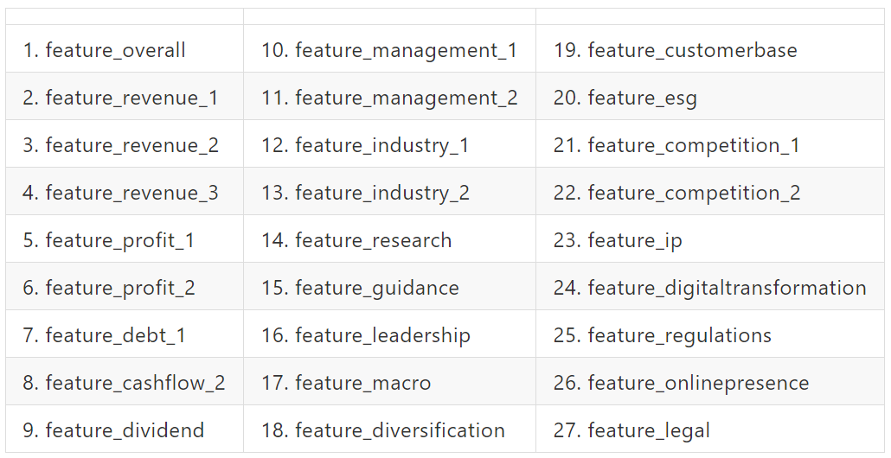
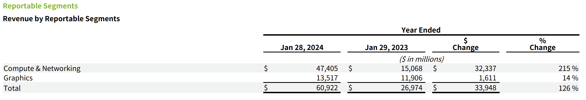

# 有 GPT 陪伴的
# 投資之路

2023/03/13

陳奎銘 Ben


---


<!-- .slide: data-background-iframe="media/Ben.html" -->


---

### 用 27 個問題

----

## 平均年化報酬 13.6%

----

# 資金成長超過 10 倍

---

> Investment must be rational; if you can't understand it, don't do it.
> 
> —— Warren Buffett, *Forbes 400, 21 October 1991*

----

看財報來了解公司？

----

財報動不動就幾十頁......看得有點累......


----

這時候就要靠高級伴讀書僮- GPT！

---

先來問問 ChatGPT 問題～

----


<!-- .slide: data-background="media/chatgpt_1.png" -->


----

發現一篇可能可以解決我的問題的 Paper

----

## `GPT-InvestAR`

> Gupta, U. (2023). GPT-InvestAR: Enhancing Stock Investment Strategies through Annual Report Analysis with Large Language Models. arXiv. https://arxiv.org/abs/2309.03079

----


看起來，我們可以試試 RAG

## Retrival Augmented Generation


---

<!-- .slide: data-background="#999999" -->

<!-- .slide: data-background-iframe="media/flow.html" -->


---

## Data

- 1505 stocks: 
    - S&P 500, S&P 400, S&P 600
    - 2002 ~ 2023
- Annual Report 
    - 10-K Filings
    - ~~[Financial Modeling Prep](https://site.financialmodelingprep.com/developer/docs/#Annual-Reports-on-Form-10-K)~~⮕[edgar-crawler](https://github.com/nlpaueb/edgar-crawler)
    - $ 29 ⮕ free <!-- .element: class="fragment" data-fragment-index="1" -->
- Stock Price
    - 每日收盤價 (Adj Close)
    - ~~OpenBB~~ ⮕ Yahoo! Finace 

Note:
    美國證券交易委員會 SEC https://www.sec.gov/edgar/searchedgar/companysearch
    分年分配目標值：目的：為了在每年內相對排名股票的回報。方法：每年單獨分配股票的目標值，這樣可以更好地比較同一年內不同股票的表現。回報的排名和標準化：首先：回報首先被排名，這意味著根據其回報率對股票進行排序。然後：然後對排名後的回報進行標準化，這有助於消除數據中的任何潛在偏差或異常值。目標值的範圍限制：範圍：[0, 1]。解釋：其中1表示更高的回報，這意味著目標值1表示該股票在該年度有更高的回報。基於百分位數的分箱：最後：對標準化的回報進行分箱，基於百分位數，這樣目標值的範圍是[0, 1]。目的：這有助於創建一個更均勻和有序的目標值分布，可以更好地用於機器學習模型的訓練。

---


### Create Feature


- Feature: Confidence Score
    - 請 GPT (GPT-3.5-Turbo) 依照公司的財報回答問題，給予<font color='red'>評分</font>
        - 為財報建立 Vector Store
            - Model: [all-<font color='red'>mpnet</font>-base-v2](https://huggingface.co/sentence-transformers/all-mpnet-base-v2)
            - Vector DB: Chroma
        - 準備關於財報的問題
        


----

### 準備關於財報的問題

- 27 Questions
- Paper 沒有明講，只有以下範例
> Does the company have a clear strategy for growth and innovation? 
> Are there any recent strategic initiatives or partnerships?

----

寄信問作者，作者回答......

----

<iframe width="560" height="315" src="https://www.youtube.com/embed/X_9lP3hM--E?si=zUgn6G2QIYAOazdY" title="YouTube video player" frameborder="0" allow="accelerometer; autoplay; clipboard-write; encrypted-media; gyroscope; picture-in-picture; web-share" allowfullscreen></iframe>

----

### 藏在程式碼的小提示




----

### GPT 幫我問問題

```
{
  "feature_overall": "On a scale of 0 to 100, how would you rate the company's overall performance and prospects based on the annual report?",
  "feature_revenue_1": "Based on the annual report, how would you rate the company's revenue performance in the last fiscal year on a scale of 0 to 100?",
  "feature_revenue_2": "On a scale of 0 to 100, how successful has the company been in expanding into new markets or segments that contributed to revenue?",
  "feature_revenue_3": "How effective were the company's strategies in increasing revenue streams, on a scale of 0 to 100?",
  "feature_profit_1": "Rate the company's profit margins in the last fiscal year on a scale of 0 to 100.",
  "feature_profit_2": "How effective has the company been in implementing cost-saving measures to improve profit margins, on a scale of 0 to 100?",
  "feature_debt_1": "Rate the company's debt management and current debt structure on a scale of 0 to 100.",
  "feature_cashflow_2": "How would you rate the company's cash flow performance in the recent fiscal year on a scale of 0 to 100?",
  "feature_dividend": "Based on the annual report, how would you rate the company's dividend payouts or changes to its dividend policy on a scale of 0 to 100?",
  "feature_management_1": "Rate the effectiveness of the significant decisions made by the management in the recent year on a scale of 0 to 100.",
  "feature_management_2": "How successful has the management been in initiating strategic partnerships or alliances, on a scale of 0 to 100?",
  "feature_industry_1": "Rate the company's positioning and competitive advantages in its industry on a scale of 0 to 100.",
  "feature_industry_2": "How proactive has the company been in identifying new industry trends or opportunities for expansion, on a scale of 0 to 100?",
  "feature_research": "Rate the company's investments in research and development on a scale of 0 to 100.",
  "feature_guidance": "Based on the annual report, how clear and promising is the company's financial guidance or outlook for the upcoming fiscal year on a scale of 0 to 100?",
  "feature_leadership": "Rate the effectiveness and vision of the company's leadership or organizational structure on a scale of 0 to 100.",
  "feature_macro": "How well is the company adapting to macroeconomic factors and global market trends, on a scale of 0 to 100?",
  "feature_diversification": "Rate the company's diversification strategies in terms of mitigating risks and enhancing growth on a scale of 0 to 100.",
  "feature_customerbase": "How would you rate the company's efforts in expanding its customer base or improving customer retention on a scale of 0 to 100?",
  "feature_esg": "Rate the company's initiatives in terms of environmental, social, and governance (ESG) factors on a scale of 0 to 100.",
  "feature_competition_1": "Rate the company's positioning against its primary competitors on a scale of 0 to 100.",
  "feature_competition_2": "How well has the company identified and addressed new competitive threats or market challenges, on a scale of 0 to 100?",
  "feature_ip": "Rate the company's efforts in securing new intellectual property or patents on a scale of 0 to 100.",
  "feature_digitaltransformation": "How would you rate the company's steps towards digital transformation and technological advancements on a scale of 0 to 100?",
  "feature_regulations": "Rate the company's efforts in navigating regulatory challenges and compliance requirements on a scale of 0 to 100.",
  "feature_onlinepresence": "How effective has the company been in expanding its online presence and digital marketing strategies, on a scale of 0 to 100?",
  "feature_legal": "Based on the annual report, how would you rate the company's handling of legal issues or litigation in the recent year on a scale of 0 to 100?"
}

```


----

### RAG 的效果
- 以 NVDA 2024-02-21 的財報為例：
> Based on the annual report, how would you rate the company's <font color='red'>revenue performance</font> in the last fiscal year on a scale of 0 to 100?

----

### RAG 的效果


- Page: 39
    - Revenue Change: <font color='red'>126%</font>
- The confidence score for the company's revenue performance in the last fiscal year is <font color='red'>90</font> out of 100.


---

## Model

- Linear Regression: enforces non-negativity in the coefficients
    - Input
        - Confidence Scores from GPT-3.5-Turbo
    - Output
        - Target Value from Stock Price

---

## Cost

- Money: $122.46 + $29 = $151.46
- Time: 214 hours
    - Build Vector Store: 190 hours
    - Get Confidence Score: 24 hours
- 4 core CPU + 16G RAM 
- Storage: ~115 G


---

## Result


----

### 假設一開始投入 $1 
- 選擇每年最強 5 檔股票
- 複利


----


----

### 小問題

- 每間公司 10-K filings 公佈時間實際上是散佈在 12 個月
- 若在年底觀察完該年度所有公司的 10-K filings，卻發現....
    - 最強股票其實在一月就公布財報了...... <!-- .element: class="fragment" data-fragment-index="1" -->
    - 需要時光機..... <!-- .element: class="fragment" data-fragment-index="2" -->

----

### 滾動式作法

- 建立模型
    - 以 2002 年的資料開始建立模型，作為初始模型
    - 隔年年初重新訓練一次模型
- 挑選股票
    - 每個月取得該年度當下可取得的財報
    - 於月底預測未來 12 個月最強的五檔股票
- 月初開盤進場，月底收盤出場
- 避開突發的損失
    - 下跌 10 % 就停止交易
    - 觀察後續的情況，若可獲利，隔月進場下單


----

<!-- .slide: data-background-iframe="media/rolling_model_2003_2022_trick.html" -->


----

<!-- .slide: data-background-iframe="media/rolling_annual_return_2003_2022_trick.html" -->


----

### 回測績效

- 年化報酬率：13.6%
- 最大交易回落：27.1%
- Sharpe Ratio: 0.088
- 勝率：62.5%

----


<!-- .slide: data-background-iframe="media/cumulative_amount_2003_20240227_sp500_trick.html" -->

---

這個做法，會不會很花錢啊？

----

<!-- .slide: data-background-iframe="media/rolling_k_return_expense.html" -->


---


<h2><font color='black'>自動化</font></h2>

<!-- .slide: data-background="media/airflow.png" -->


----


----

<!-- .slide: data-background="media/SMCI.png" -->


---

如果不想麻煩的話，還是......

----

ETF and Chill


---

## 下一步，還能做什麼？

- 抽換 model
- Semantic Chunking
- 讓 GPT 看完所有財報
- 改變問題
- 投入小量資金做測試

---

## 總結

- 有機會打敗大盤的獲利方式- GPT-InvestAR
    - 利用 GPT 和 RAG 將年報化為分數
    - 利用分數建立 Machine Learning Model
- 實際的進出場策略，須考慮實務上的情況

----

# 財報靠 GPT

----

# 投資靠自己


----

# Thank You

----


  